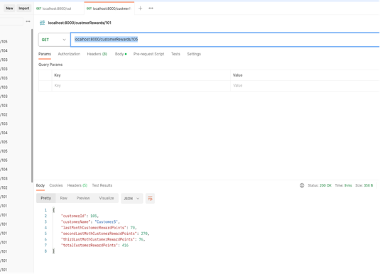

# homework

homework
1.)Checkout the project from https://github.com/varungautam1411/rewardpoints.git in the IDE used.
2.) Choose H2 DB as the data source with below details, this should match the configurations mentioned in
application.properties
Username : vg
Password : vg
URL : jdbc:h2:mem:rewardpoints
3.)Run the scripts mentioned in data.sql
4.)Run the RewardpointsApplication as Java application
5.)From postman hit any of the below URLs to GET the result
localhost:8000/customerRewards/101
localhost:8000/customerRewards/102
localhost:8000/customerRewards/103
localhost:8000/customerRewards/104
localhost:8000/customerRewards/105

Exceptions added :

1.) MonthOlderThanThreeException : This exception is thrown when the month of transaction is older than 3 .
    URL : /customerRewards/106
2.) NotCurrentYearException : This exception is thrown when the year of transaction is not current (2024).
    URL : /customerRewards/108
3.) NoTransactionMadeException : This exception is thrown when the customer id in the URL is not present in our customer table.
    URL : /customerRewards/109
4.) RecentTransactionException : This exception is thrown when the transaction is done in current month.
    URL : /customerRewards/107

Test cases :

Run the java class TestApplication as a JAVA application to run all the test cases.
Each test case can be run individually also.

1.) shouldReturnJSON() : This test case ensures that JSON is returned for a valid customer ID
    URL:/customerRewards/101
    STATUS: 200

2.) purchaseOlderThanThreeMonths() : This test case checks for 404 error in the response.
    URL :/customerRewards/106
    STATUS : 404
    Body : "Month of purchase Older than three".

3.) notCurrentYear() : This test case checks if the year of transaction is not current.
    URL : /customerRewards/108
    STATUS : 404
    Body : "This purchase is not of this year".

4.) transactionNotOldEnough() : This test case checks if the date of transaction is a recent one.
    URL : /customerRewards/107
    STATUS : 404
    Body : "Transaction date is less than a month old".

5.) noTransactionMade() : This test case checks if the customer id exists in DB .
    URL : /customerRewards/109
    STATUS : 404
    Body : "No transaction made by this customer".